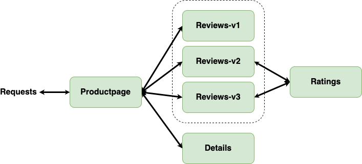

# Bookinfo Application using gRPC

This repo contains gRPC implementation of the bookinfo application designed by Istio. 

See <https://istio.io/docs/examples/bookinfo/>.

<!-- ||
|:--:| 
| *Bookinfo Application Call Graph* | -->

## Installation

You can use `. ./scripts/k8s_setup.sh` and `. ./install.sh` to install/build kubernetes, istio, and wrk/wrk2, change `config.sh` if needed.

## Build docker images and push them to docker hub

```bash
python3 ./scripts/data_gen.py # generate data in ./data, optional
sudo bash build-images.sh # you need to change the username and run docker login
```

## Run Bookinfo Applicaton

```bash
kubectl apply -Rf ./kubernetes/apply
kubectl get pods
```


## Run load generator

```bash
./wrk/wrk -t1 -c1 -d 10s http://10.96.88.88:8080 -L -s ./scripts/lua/bookinfo.lua
```

## view Jaeger traces

Use `kubectl get ep | grep jaeger` to get the location of jaeger service.

View Jaeger traces by accessing:
- `http://<jaeger-ip-address>:<jaeger-port>`  

### Cleanup

```bash
bash ./kubernetes/cleanup.sh
```

## Development

### Protobuf 
```bash
protoc --go_out=. --go_opt=paths=source_relative \
    --go-grpc_out=. --go-grpc_opt=paths=source_relative \
    proto/reviews/review.proto 
```
